# 💻 Laboratório Prático: Configuração de uma Instância de Banco de Dados no Azure

## 📚 Sobre este projeto

Esse projeto faz parte de um laboratório prático que realizei para aprender como configurar uma instância de **Banco de Dados no Microsoft Azure**. O objetivo era entender todo o processo de criação do recurso.

Aqui você encontra um **passo a passo direto**, com anotações, dicas pessoais e capturas de tela do processo. Espero que sirva como apoio tanto para meus estudos quanto para quem estiver começando nessa jornada.

---

## 🚀 Tecnologias utilizadas

- 🌐 [Microsoft Azure](https://portal.azure.com/)

---

## 🛠️ Etapas que segui

1. **Acesso ao Portal Azure**  
   Fiz login no [portal do Azure](https://portal.azure.com) e iniciei a criação de um Banco de Dados SQL.

2. **Criação do Grupo de Recursos**  
   Criei um novo grupo chamado `lab-sql-database_group` para organizar os recursos do projeto.

3. **Configuração da Instância SQL**
   - **Nome do banco de dados:** `lab-sql-database`
   - **Servidor:** criei um novo chamado `lab-database-sqlazure`
   - **Localização:** `(South America) Brazil South`
   - **Método de autenticação:** escolhi **Autenticação SQL**, definindo login `labuser` e uma senha segura
   - **Computação + armazenamento:** "Configurar banco de dados" - **Camada de serviço**, selecionei a opção **Básico** para manter o custo baixo

4. **Revisar + Criar**
   - Após revisar todas as configurações, confirmei a criação da instância.

5. **Implantação realizada com sucesso**
   - O Azure provisionou os recursos e deixou tudo pronto para conexão.
     
---

## 📸 Prints do processo

As capturas de tela estão nomeadas de **Passo 1** até **Passo 11**, ilustrando cada etapa do processo de criação e configuração da instância de banco de dados no Azure — desde o acesso ao portal até a execução de comandos SQL para validação.

Você encontra todas as imagens organizadas na pasta `/images`:

| Etapa                     | Imagem                               |
|--------------------------|--------------------------------------|
| Acesso ao Portal Azure   | 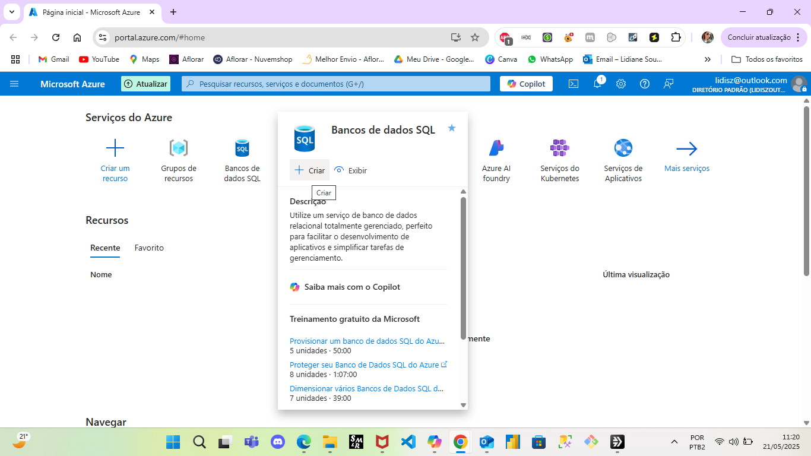      |
| Criação do Grupo de Recursos | 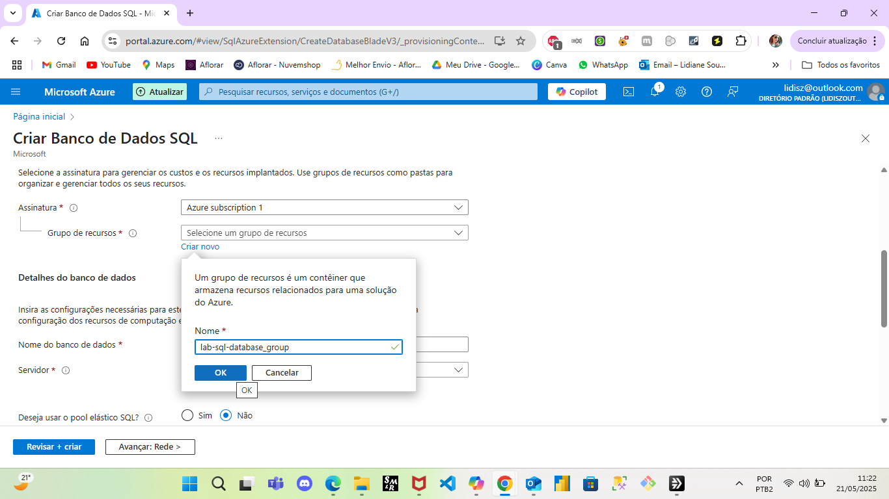  |
| Criação do Banco SQL     | 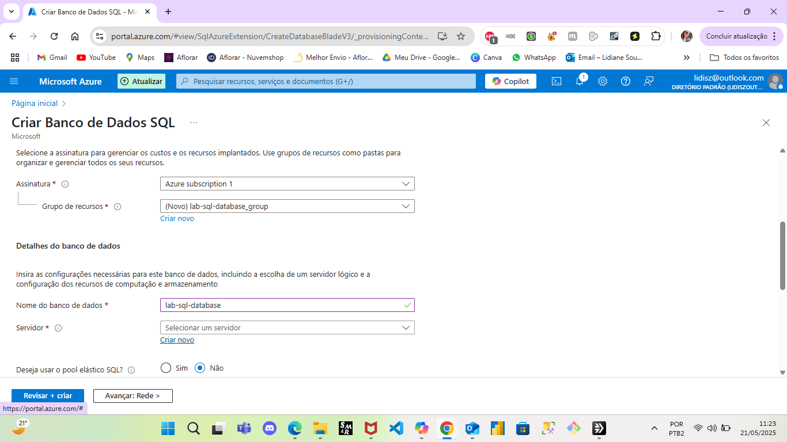      |
| Configuração do Servidor | 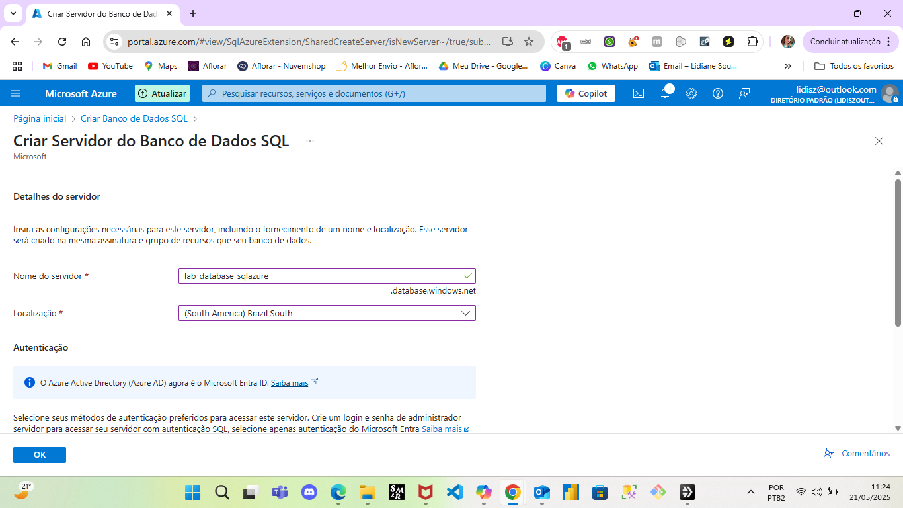      |
| Definição de Login/Senha | 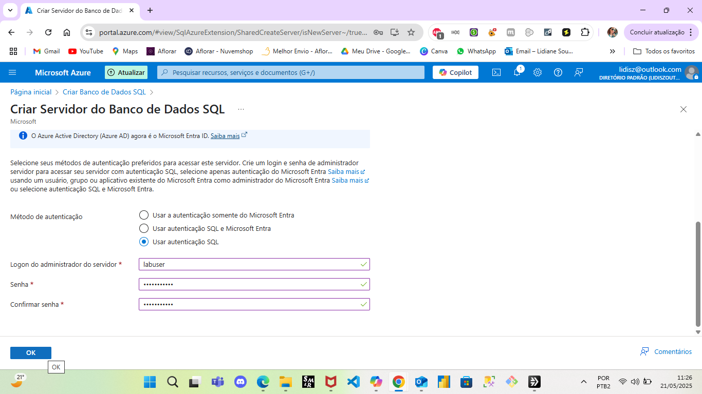      |
| Configuração do Banco de Dados | 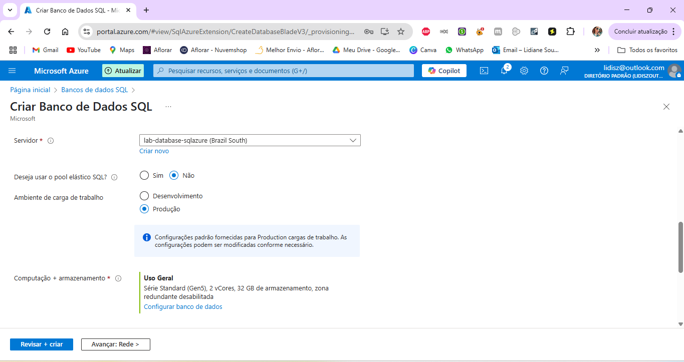      |
| Seleção da Camada Básica | 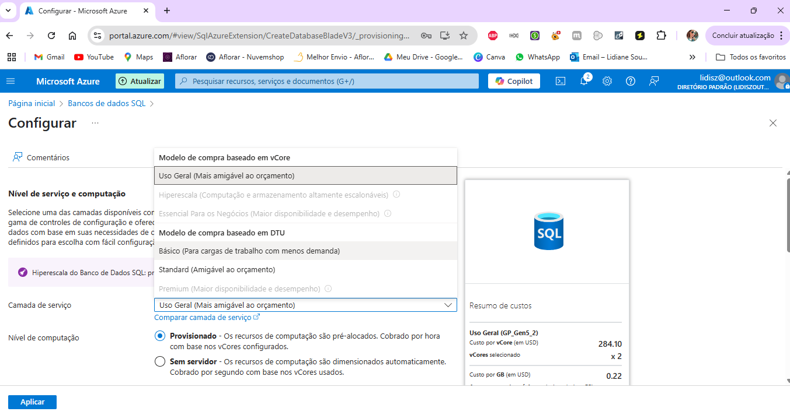      |
| Revisão e Criação da Instância     | 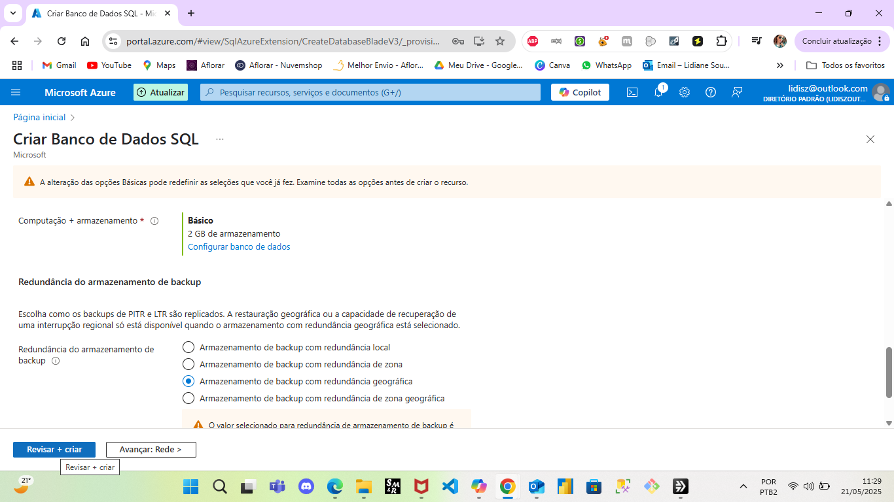      |
| Criação da Instância     | 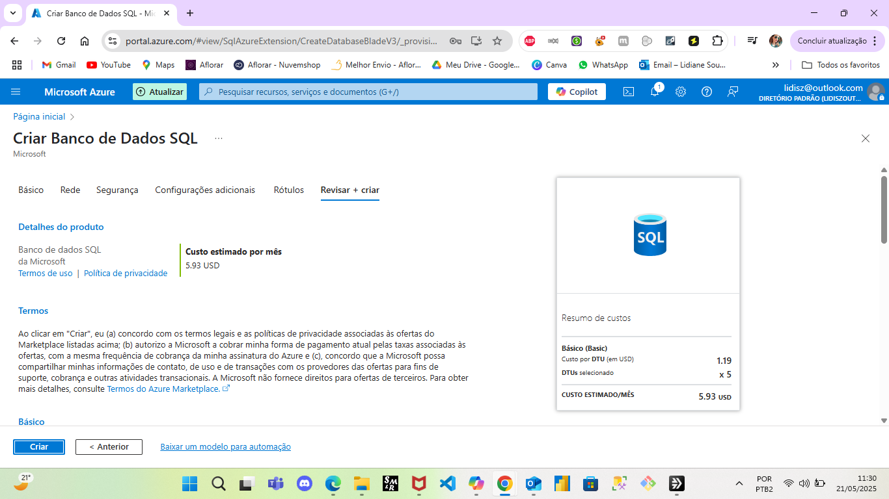      |
| Implantação da Instância   | 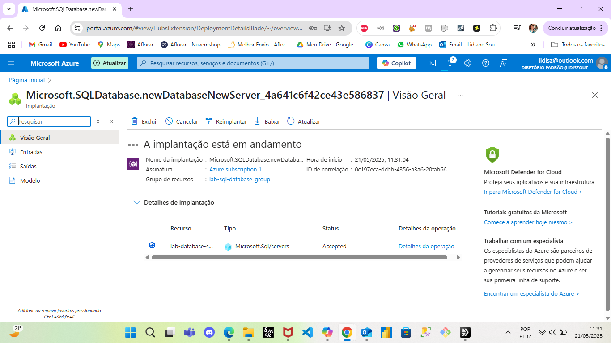     |
| Validação do Processo  | 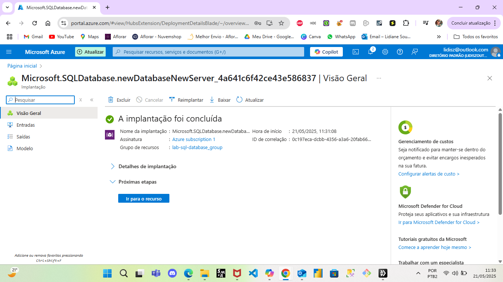     |

## ✅ Conclusão

Esse laboratório me deu uma visão mais prática sobre o funcionamento de serviços na nuvem, especialmente na parte de bancos de dados. Sinto que agora tenho uma base mais sólida para avançar em projetos mais robustos e seguir evoluindo nesse universo de tecnologia.

Se esse repositório te ajudou de alguma forma ou se quiser trocar ideias, fique à vontade para me chamar! 🚀

## 📁 Estrutura do Projeto

📦 lab-sql-databaseazure
├── 📁 dicas/              # Anotações, aprendizados e observações pessoais
│   └── aprendizados.md   # Dicas e aprendizados extraídos do laboratório
│
├── 📁 images/             # Capturas de tela do processo (passo 1 ao 11)
│   ├── passo-01.png
│   ├── passo-02.png
│   └── ...
│
└── README.md             # Descrição geral do projeto e passo a passo

📎 Para mais dicas e aprendizados, veja [dicas/aprendizados.md](dicas/aprendizados.md)
